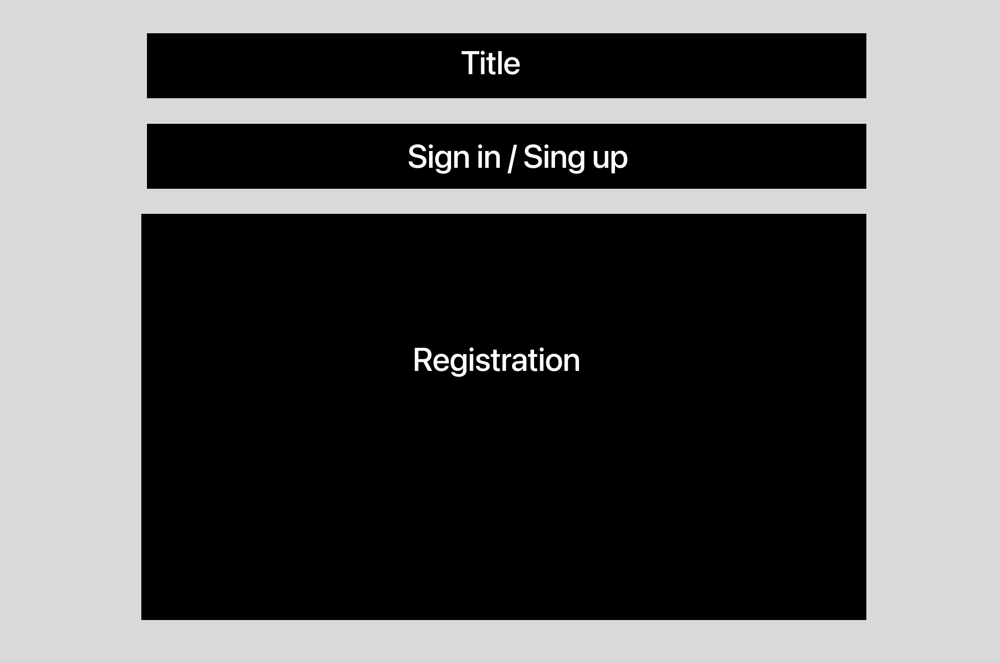
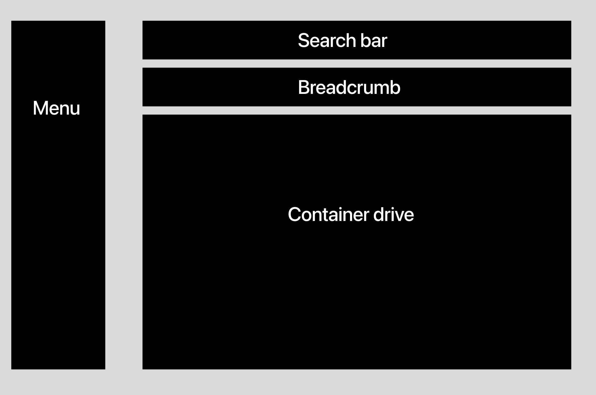
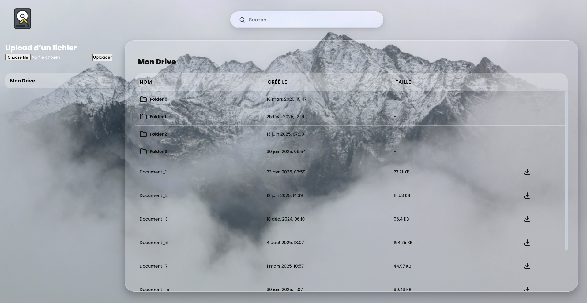

# Réduction de l'impact écologique d'un service numérique de partage de documents

## Choix du Sujet

En tant qu’étudiants et futurs ingénieurs, le partage de documents de travail est une pratique très courante. L’essor du numérique a par ailleurs entraîné une augmentation significative de l’utilisation de ces services, et donc de la quantité de documents échangés. Il nous paraît donc pertinent de proposer une solution capable de répondre à cette demande croissante, tout en prenant en compte son impact sur l’environnement et en le limitant le plus possible.

## Utilité Sociale

Le partage de documents numériques joue un rôle central dans notre société actuelle. Il constitue un outil essentiel pour la collaboration, la transmission des savoirs et l’efficacité au travail. Dans un contexte où l’enseignement, la recherche et la vie professionnelle reposent de plus en plus sur la circulation rapide et fluide de fichiers, un service de partage de documents représente un vecteur incontournable de coopération.

Au-delà de la simple commodité, son utilité sociale est multiple.

* Dans l’éducation, il permet aux étudiants, enseignants et chercheurs d’échanger facilement cours, supports pédagogiques et résultats de travaux, favorisant ainsi la diffusion des connaissances.

* Dans le monde professionnel, il soutient le travail collaboratif, en particulier dans un contexte de télétravail et d’équipes réparties géographiquement.

* Dans la sphère personnelle et associative, il rend possible la mise en commun de projets, la coordination d’événements ou encore le partage de ressources utiles au quotidien.

Le partage numérique de documents contribue donc directement à la réduction des inégalités d’accès à l’information : chacun peut consulter, modifier ou enrichir un fichier sans avoir besoin de moyens matériels lourds, coûteux ou polluants (impressions papier, déplacements physiques, envoi postal).

## Effet de la numérisation

Avant la création du numérique, le partage de documents reposait sur des moyens matériels : impressions papier, photocopies, envois postaux ou déplacements physiques pour transmettre l’information. Ces pratiques avaient un coût élevé, tant en ressources qu’en temps :

* Consommation de papier : chaque échange nécessitait plusieurs copies imprimées, contribuant à la déforestation, à l’utilisation d’eau et de produits chimiques pour la fabrication du papier.

* Envoi postal : le transport des documents par courrier ou messagerie impliquait une logistique élevée (véhicules, carburants, emballages), avec une empreinte carbone importante.

* Déplacements physiques : réunions ou échanges nécessitaient parfois de se déplacer pour remettre ou consulter un document, ce qui générait des émissions supplémentaires liées aux transports.

* Stockage matériel : conserver les documents exigeait des classeurs, armoires et espaces dédiés, eux-mêmes producteurs de déchets et limités en capacité.

La numérisation a transformé cette dynamique :

* Un fichier numérique peut être dupliqué et diffusé instantanément sans consommation supplémentaire de papier ni de carburant.

* Le stockage dématérialisé réduit la nécessité d’espaces physiques et facilite l’archivage.

* La rapidité et la facilité de transmission renforcent l’efficacité des échanges, permettant à des millions de personnes d’accéder à l’information quasi simultanément.

Ainsi, la numérisation représente une rupture majeure : elle diminue fortement l’usage de ressources matérielles traditionnelles (papier, transport, logistique) et démocratise l’accès au savoir.

## Scénarios d’usage et impacts

Nous partons de l'hypothèse que l'utilisateur du drive accède plusieurs fois par jour sur son interface pour importer et exporter des fichiers. Pour cette raison, nous prendrons en compte l'accès aux fichiers une seconde fois après chaque exportation/importation pour voir l'effet du cache.

### Scénario 1 : Importation d'un fichier dans le drive

- L'utilisateur accède à son drive
- Il clique sur le bouton pour importer un fichier
- Il choisit le fichier et valide l'importation
- L'utilisateur se retrouve nouveau sur la page d'accueil de son drive

### Scénario 2 : Exportation d'un fichier dans le drive

- L'utilisateur accède à son drive
- Il sélectionne le fichier qu'il souhaite télécharger
- Il clique sur le bouton télécharger pour récupérer le fichier
- L'utilisateur se retrouve nouveau sur la page d'accueil de son drive

### Scénario 3 : Navigation dans le drive

- L'utilisateur accède à son drive
- Il scroll pour trouver le dossier souhaité
- Il clique sur un dossier pour accéder à son contenu

## Impact de l'exécution des scénarios auprès de différents services concurrents

Nous avons choisi de comparer l'impact des scénarios pour les services de stockage de documents en ligne les plus utilisés et connus du grand public. Pour cela, nous avons choisi Google Drive, Microsoft OneDrive et DropBox.

Et, pour calculer l'impact de ces scénarios, nous avons dû calculer à la main les scores et classes écoindex des services. Vous pouvez retrouver plus de détails sur comment nous avons réalisé les mesures dans la partie benchmark, accessible dans les liens du tableau ci-dessous.

| Service | Score (sur 100) | Classe | Détail des mesures |
| ----------- | ----------- |----------- | ----------- |
| Google Drive | 5.7 | G | [...](./benchmark/GoogleDrive/benchmark.md) |
| Microsoft OneDrive | 16.2 | F | [...](./benchmark/Microsoft/benchmark.md) |
| DropBox | 12.4 | F | [...](./benchmark/DropBox/benchmark.md) |

### Analyse des résultats

Pour la majorité des services, nous pouvons constater que nous obtenons un score qui est très bas. Cela peut s'expliquer par plusieurs facteurs divers. Nous avons effectué les tests sur nos comptes personnels pour Google et Microsoft. Ces comptes contiennent ainsi déjà beaucoup de données. Le nombre de requêtes et d'éléments du DOM étant relatif au nombre de fichiers stockés sur notre compte, les mauvais résultats peuvent s'expliquer de cette manière.

Malgré cela, nous avons donc décidé d'intégrer un service que nous n'avions jamais utilisé, ici Dropbox. Cela nous permet de confirmer que les très mauvais résultats peuvent s'expliquer par la quantité de données stockées sur le service. Cependant, nous pouvons tout de même constater que les scores obtenus pour un service vide sont toujours très bas. Cela peut s'expliquer par la quantité d'éléments graphiques qui s'affichent à l'écran pour une simple action (pop-up de confirmation, animation, ...) ou encore par les nombreux traqueurs qui s'installent au chargement de la page.

## Modèle économique

Comme nous l’avons observé précédemment, une part importante de l’impact environnemental d’un service numérique découle directement de son modèle économique. En effet, ce modèle conditionne le volume de données échangées, le nombre d’utilisateurs actifs, les pratiques de stockage et la fréquence des sollicitations réseau. Il est donc nécessaire d’analyser les principaux acteurs du partage de documents afin d’en déduire les leviers possibles de sobriété.

| Service | Accès gratuit | Abonnement Payant | Répartition des revenus |
| ----------- | ----------- |----------- | ----------- |
| Google Drive | 15 Go gratuits | 100 Go à 2 €/mois / 2 To à 10 €/mois | Freemium (publicités indirectes via l’écosystème Google) |
| Microsoft OneDrive | 5 Go gratuits | 100 Go à 2 €/mois / 1 To à 10 €/mois / 6 To à 13 €/mois (famille) | Freemium (abonnement Microsoft 365, intégration écosystème) |
| DropBox | 2 Go gratuits | 2 To à partir de 12 €/mois / 3 To à 20 €/mois | Freemium (abonnement pur, sans publicité) |

Tab. 1 : Offres des principaux services de partage de documents (particuliers).

Ces offres présentent des caractéristiques communes :

* Un accès gratuit limité, financé par d’autres activités (publicité, intégration logicielle, collecte de données).

* Des formules payantes permettant un stockage accru et la suppression des restrictions.

* Une forte incitation à l’abonnement, souvent couplée à d’autres services du même groupe (Gmail, Office, etc.).

Les différences se situent surtout dans la nature des revenus et leur dépendance à la donnée utilisateur :

* Google Drive et OneDrive tirent parti d’écosystèmes complets (publicité ciblée, synchronisation, analyse de l’usage), ce qui alourdit indirectement l’empreinte carbone liée au suivi et à la personnalisation.

* Dropbox, reposant uniquement sur un modèle par abonnement, se montre plus neutre sur le plan de la collecte de données, mais nécessite un volume d’utilisateurs payants élevé pour rester viable.

Le seul modèle alternatif identifié est celui de **Nextcloud**, totalement gratuit mais reposant sur des **dons** et des **services d’hébergement professionnels** proposés par des partenaires. Il est probable que la maintenance plus limitée de sa plateforme publique (par rapport à un service grand public tel que Google Drive) nécessite une équipe technique plus réduite.

| **Source possible de revenus** | **Montant unitaire** | **Quantité nécessaire pour financer un salaire¹** |
|--------------------------------|----------------------|--------------------------------------------------|
| Abonnement (2 €/mois) | 24 €/an | 500 |
| Affichage d’une publicité (régie tierce) | 0,00046 €² | 26 000 000 |
| Diffusion d’une publicité (régie intégrée) | 10 000 €³ | 1,2 |
| Vente de services complémentaires (hébergement sécurisé, support premium) | 200 €⁴ | 60 |

**Tab. 2 : Sources de revenus possibles pour un service de stockage en ligne.**

L’étude de l’offre des services cloud destinés au grand public (cf. Tab. 2) nous a permis d’identifier les principales sources de revenus utilisées. Associées à un bref état de l’art (cf. Tab. 3), nous avons pu établir que :

- la **revente ou l’exploitation des données d’usage** n’est pas une source de revenu directe, mais elle alimente le ciblage publicitaire ;  
- les deux modèles de publicité les plus courants sont le **revenu pour mille vues (RPM)** et le **revenu par clic (CPC)** ; le second domine pour les régies tierces, tandis que le premier sert surtout à estimer les revenus moyens ;  
- une **régie intégrée** (bandeaux internes, partenariats directs) génère des revenus bien plus élevés qu’une régie tierce ;  
- un **modèle par abonnement** est celui qui assure la meilleure stabilité financière pour un service cloud.  

**Par conséquent**, pour limiter les coûts et l’impact écologique liés au trafic publicitaire, nous proposons de :

- renoncer aux publicités gérées par des régies tierces,  
- adopter un **modèle hybride**, basé principalement sur les **abonnements**,  
- le compléter par un **bandeau publicitaire interne** réservé aux utilisateurs non abonnés,  
- et explorer un **modèle de dons** pour les utilisateurs particuliers souhaitant soutenir la version gratuite du service.

---

¹ Hypothèse basée sur un salaire brut annuel de 12 000 € et une marge opérationnelle de 20 %.  
² [Source : Google AdSense — définition et calcul du RPM](https://support.google.com/adsense/answer/112032?hl=fr)  
³ [Source : Estimations de campagnes à régie intégrée — Le Figaro / régies médias françaises](https://www.lefigaro.fr/medias/)  
⁴ [Source : Étude de prix de services premium cloud (Nextcloud / ownCloud / Pydio)](https://nextcloud.com/pricing/)

## Maquette de l'interface et échantillon de données

Au vu des différents services comparés, des exigences environnementales exprimées précédemment et des scénarios d’usage retenus, nous avons défini pour notre prototype une maquette de l'interface et un échantillon de données réalistes.

Les ressources numériques présentes sur notre application seront de deux types principaux :
  - un dossier ou un répertoire (avec une HTTP-URI ayant pour chemin / pour la racine ou /folder/{name} pour un dossier spécifique) ;
  - un document (avec pour chemin /document/{id} pour accéder à un fichier particulier).

### Maquettes

Maquette 1 : page d’inscription / connexion
Interface permettant de créer un compte, se connecter et gérer l’authentification.

Fig.1 : Maquette de la page d’inscription / connexion.

Maquette 2 : page principale de l’application
Gestion des fichiers et dossiers, accès rapide aux fichiers récents, possibilité d’importer, exporter et partager des fichiers.

Fig.2 : Maquette de la page principale avec listes de dossiers et fichiers.

## Implémentation du scénario prioritaire

### Étape de prototypage : Données chargées de manière statique

Pour cette première version du prototype (v1.0.0) :

* L'échantillon de données est encore chargé directement dans le code de manière statique.

* Les fonctionnalités implémentées sont uniquement celles nécessaires pour suivre le scénario prioritaire : la gestion des fichiers dans le drive (importation, exportation, navigation dans les dossiers).

* Ce scénario nécessite de pouvoir naviguer entre deux types de page : la page principale du drive et les pages de contenu d’un dossier ou d’un document.

Nous avons développé la page principale du drive pour qu'elle affiche l'échantillon de fichiers et dossiers sous une forme proche de la maquette initiale (cf. Fig. 2).

Prototype de la page principale du drive – Fig.3

Pour l'instant, nous n'avons choisi aucun framework. L'objectif est de limiter l'impact environnemental lié au frontend. Dans la suite du projet, nous évaluerons si l'utilisation d'un framework plus complet (Bootstrap, MaterialUI, etc.) est acceptable.

Nous avons décidé de ne pas inclure de fichiers volumineux ou d’aperçus générés (images) afin de réduire le nombre de requêtes et la taille totale des pages.

Le problème de cette application est que le chargement des données dépend des fichiers présents dans le drive et importés par l’utilisateur. Si ce dernier ajoute des fichiers volumineux, le score EcoIndex peut chuter drastiquement. Pour limiter cet impact, le projet restreindra les fichiers autorisés aux formats PDF, DOCX et TXT uniquement.

Pour l’implémentation des scénarios, nous avons remarqué qu’il y en a un que nous ne pouvons pas réellement évaluer : l’importation des fichiers. En effet, avec les outils utilisés pour calculer la consommation des requêtes, nous ne sommes pas en mesure de mesurer l’impact lorsque l’utilisateur navigue dans son explorateur de fichiers pour sélectionner un document à importer.

Dans l'état actuel du prototype, on peut des a présent avoir une idée sur l'impact environnemental de notre frontend. Cela nous permettra de faire des choix éclairés pour la suite du projet. Elle nous permet également de voir la différence entre une plateforme de développement et la plateforme de pré-production.

|       | EcoIndex | GES (gCO2e) | Taille du DOM | Requêtes | Taille de la page (ko)|
| ---| -----------: | -----------: |-----------: | -----------: | -----------:|
| Mode "développement" | 66 C 🟨 | 1,68 | 145 | 54 | 7995 |
| Mode "pré-production" | 74 B 🟩 | 1,52| 136 | 21 | 5328 |

Tab 3 : Évaluation de l'impact du prototype de la page d'accueil du drive.

### Pages des dossiers

Les pages des dossiers ont pour HTTP-URI`/{id}`. Nous avons de mettre un public uuid pour chaque dossier. Cela permettra aux utilisateurs de pouvoir modifier le nom du dossier sans que cela n'impacte l'URL.

## Auteurs

* Antoine MAZEAU
* Rémy Kinzelin
